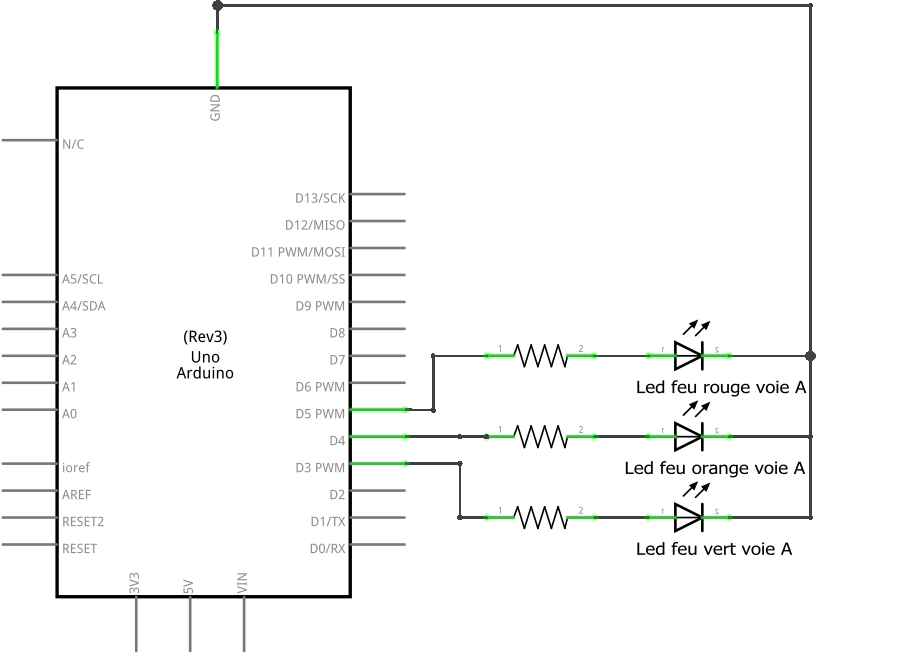
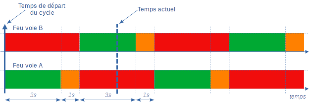

# TP. Feux de carrefour

!!! abstract "Objectif"
    { align=right }
    On souhaite simuler le fonctionnement de feux d'un croisement de deux voies (A et B).
    On étudiera ici la mise en oeuvre d'une carte Arduino Uno et de modèles réduits de feux de carrefour.

    - réaliser la maquette à partir du schéma électronique, à l'aide d'une plaque d'expérimentation ;
    - saisir et comprendre le programme : créer d'autres fonctions que _setup_ et _loop_ ; utiliser l'instrution _millis()_ pour gérer les délais.
    - faire évoluer le programme pour y ajouter un deuxième feu, puis d'autres fonctions.

## Matériel nécessaire
- une carte Arduino Uno ;
- une plaque d'expérimentation ;
- deux feux tricolores ;
- 8 câbles male-male ;
- un câble USB A ;
- le logiciel Arduino.

## Schéma électronique

{width=600px}

## Représentation du fonctionnement des feux

On peut représenter le fonctionnement des feux de carrefour par ce _chronogramme_. On considère qu'il y a deux voies qui se croisent dans notre carrefour : la voie __A__ et la voie __B__ : 

{width=800px}

## Programme et explications

### Informations générales
On décrit le programme dans un en-tête, au début du programme. Cette zone permet d'indiquer quelques informations principales : l'auteur du programme, l'organisme, éventuellement la version. __ Ne négligez pas cette partie !__  
Cette partie ne sera pas exécutée, elle appraît sous la forme d'un bloc de commentaires.

``` arduino
/*
/ Utilisation de la fonction millis() pour gérer 
/ les feux de carrefour.
/ Philippe Morin - Lycée Jules Verne 
*/
```

### Intitialisation
``` arduino
void setup() {
  pinMode(feuRougeVoieA, OUTPUT);
  pinMode(feuOrangeVoieA, OUTPUT);
  pinMode(feuVertVoieA, OUTPUT);
 
  departCycle = millis();
}
```