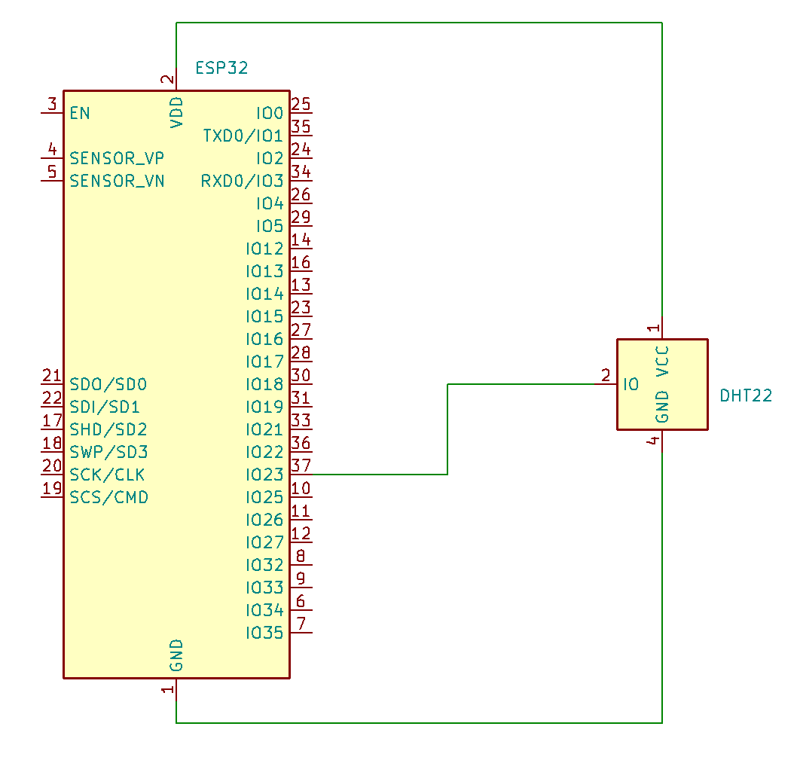
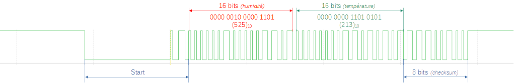

# TP. Mesure de la température avec un capteur DHT22

!!! note "Objectifs"
    On souhaite dans ce TP mesurer la température avec un capteur DHT22.  
    Ce capteur se branche sur une broche numérique d'une carte électronique type Arduino ou Esp32...  
    __Comment sont envoyées les informations d'humidité et de température du capteur vers la carte ?__

## Matériel nécessaire
- [DHT 22](https://www.gotronic.fr/art-module-capteur-t-et-humidite-sen-dht22-31502.htm){target=_blank}.
- Carte électronique type [Arduino Uno](https://www.gotronic.fr/art-arduino-uno-a000066-12420.htm){target=_blank} ou [ESP32](https://www.gotronic.fr/art-module-nodemcu-esp32-28407.htm){target=_blank}.
- [Analyseur logique](https://amzn.eu/d/0e806SJ){target=_blank} et [son logiciel](https://www.saleae.com/downloads/){target=_blank}, à télécharger et à installer.

## Câblage

Le signal du capteur DHT22 est relié à la broche __23__ de l'ESP32. Les deux autres broches correspondent à l'alimentation du capteur et sa mise à la même masse que l'ESP32.   
{ width=500px }
## Programme

Le programme en entier :

!!! warning "Attention !"
    Le seul point à surveiller est le numéro de la broche utilisée. Dans ce cas, `brocheDHT` est la broche 23 (la carte utilisée est une ESP32).

``` arduino

#include "DHT.h"
 
// Définit la broche de l'Arduino sur laquelle la 
// broche DATA du capteur est reliée 
#define brocheDHT 23
 
// Definit le type de capteur utilisé
#define DHTTYPE DHT22
 
// Déclare un objet de type DHT
// Il faut passer en paramètre du constructeur 
// de l'objet la broche et le type de capteur
DHT dht(brocheDHT, DHTTYPE);
 
void setup() {
  Serial.begin(9600);
   
  // Initialise le capteur DHT22
  dht.begin();
}
 
void loop() {
  // Récupère la température et l'humidité du capteur et l'affiche
  // sur le moniteur série
  Serial.println("Temperature = " + String(dht.readTemperature())+" °C");
  Serial.println("Humidite = " + String(dht.readHumidity())+" %");
 
  // Attend 10 secondes avant de reboucler
  delay(10000);
}
```

Les données sont affichées toutes les 10 secondes sur le moniteur série de votre IDE (Arduino ou Visual Studio Code).

## Affichage de la trame envoyée par le capteur 
La trame se compose de 5 octets :  


Les deux premiers octets indiquent en poucentage l'humidité ; les deux suivants la température ; le dernier est la somme de vérification des quetre premiers.  

On peut observer simplement cette trame en utilisant un analyseur de trame comme celui ci-dessous :  
 { width=250px }  

Le logiciel à installer est disponible à cette adresse : [Saleae](https://www.saleae.com/downloads/).

 Le GND de l'analyseur doit être relié au GND du montage. Un des canaux doit être relié à la broche 23.

 Capture de la trame :
 

 Les 16 premiers bits indique le nombre 525, soit un taux d'humidité de __52,5%__ ; les 16 bits suivants nous donne la température : 213, soit __21,3°C__.


